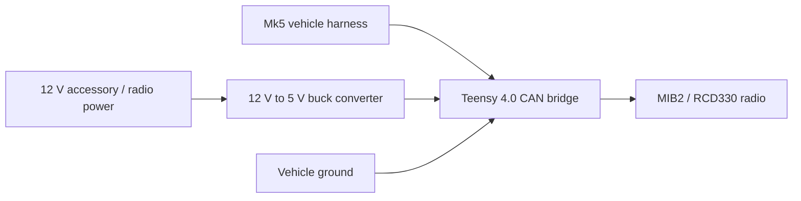
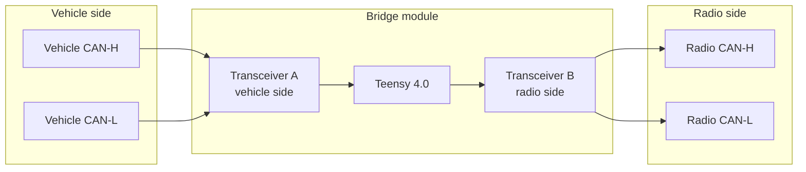

# MIB2-Can-Bridge-MK5-B6
# MK5 / B6 VW  MIB2 / RCD330 CAN Bridge

For Vehicles with RED MFD.

Gateway Upgrade still required for proper Infotainment Function.

Flash using Teensy Loader.

A Teensy 4.0 dual-CAN bridge for fixing the Screen Brightness, MFD Display, and Track/Station Seek on the Steering Wheel.

The bridge sits inline between the car and the radio. Most CAN traffic is forwarded transparently. The firmware only modifies or consumes the specific frames needed for the supported features.

## Features

- Fixes MIB2/RCD330 screen brightness on cars by correcting the illumination/dimming message.
- Keeps the radio responsive to the dash dimmer wheel when ambient/headlight illumination is active.
- Translates MIB2/RCD330 audio text to the Red MFD Audio page.
- Translates MIB2 navigation distance/street text to the Red MFD Navigation page.
- Optionally maps steering wheel MFD Up & Down buttons to previous/next while the Audio page is actively displayed.

## VCDS/OBD11 Coding Needed

5F Control Unit --> Adaptations --> Dimming illumination for Display Unit -->  `Y3` to `30%` and `Y4` to `100%` 
Security Access code may be needed: 20103

## Hardware Needed

Minimum recommended build:

| Qty | Part | Notes |
| ---: | --- | --- |
| 1 | CANBus Gateway | Gateway Upgrade needed for Proper 5F communication. `7N0907530BC` or Similar. |
| 1 | Teensy 4.0 | Main controller. |
| 2 | 3.3 V CAN transceiver modules | SN65HVD230 modules work well. Use boards with `TXD`, `RXD`, `VCC`, `GND`, `CANH`, and `CANL`. |
| 1 | 12 V to 5 V automotive buck converter | Use a high quality converter with stable output. |
| 1 | VW quadlock extension or breakout harness | Strongly preferred so the car loom does not need to be cut. |
| 1 | 2A Inline fuse | Put this on the adapter power feed. |
| As needed | Twisted pair wire | Use for both CANH/CANL runs. |
| As needed | Heat shrink, solder, crimp terminals, solder sleeves, strain relief | Build it like it will live in a dashboard, because it will. |

Recommended wire colors:

| Signal | Suggested color |
| --- | --- |
| CAN High | Yellow |
| CAN Low | Green |
| 12 V / 5 V positive | Red |
| Ground | Black |
| Teensy TX logic | White |
| Teensy RX logic | Blue |

Avoid:

- 5 V-only CAN transceiver boards unless they explicitly support 3.3 V logic or have a separate `VIO` pin.

## Wiring Overview

The module is an inline bridge. The car CAN wires go into one transceiver, the radio CAN wires go into the other transceiver, and the Teensy forwards traffic between them.

## Detailed CAN Layout

## Point-To-Point Wiring

### Power

| From | To |
| --- | --- |
| Vehicle switched/accessory 12 V | Buck converter input positive |
| Vehicle ground | Buck converter input negative |
| Buck converter 5 V output | Teensy `VIN` |
| Buck converter ground | Teensy `GND` |
| Teensy `GND` | Both transceiver `GND` pins |
| Teensy `3.3V` | Both transceiver `VCC` pins, if using 3.3 V transceiver modules |

Set and verify the buck converter output before connecting the Teensy. The Teensy wants 5 V on `VIN`, not raw vehicle voltage.

### Vehicle-Side Transceiver A

| Signal | Teensy 4.0 pin / label | Transceiver A pin |
| --- | --- | --- |
| CAN1 TX | `CTX1`, pin `22` | `TXD` |
| CAN1 RX | `CRX1`, pin `23` | `RXD` |
| 3.3 V | `3.3V` | `VCC` |
| Ground | `GND` | `GND` |
| Vehicle CAN High | vehicle harness CAN-H | `CANH` |
| Vehicle CAN Low | vehicle harness CAN-L | `CANL` |

### Radio-Side Transceiver B

| Signal | Teensy 4.0 pin / label | Transceiver B pin |
| --- | --- | --- |
| CAN2 TX | `CTX2`, pin `1` | `TXD` |
| CAN2 RX | `CRX2`, pin `0` | `RXD` |
| 3.3 V | `3.3V` | `VCC` |
| Ground | `GND` | `GND` |
| Radio CAN High | radio harness CAN-H | `CANH` |
| Radio CAN Low | radio harness CAN-L | `CANL` |

Notes:

- `TXD`/`RXD` are logic signals between the Teensy and the transceiver. They do not correlate to CAN-H/CAN-L.
- `TXD`/`RXD` do not need to be twisted pair. Keep them short and tidy.
- `CANH`/`CANL` should be twisted pair.
- If your transceiver module has an `RS`, `S`, or standby/slope pin, configure it for normal high-speed operation according to that module's documentation. On many SN65HVD230-style boards, this means tying `RS` low.

## Termination

Most cheap CAN trancievers include a 120 ohm resistor across `CANH` and `CANL`. In this inline bridge, each side connects into an existing vehicle/radio CAN segment, so extra termination is usually not wanted. MAKE SURE TO REMOVE THIS RESISTOR.

Display features:

- Audio and Navigation translation are both enabled by default.
- Navigation takes priority while route guidance is active.
- Navigation currently shows distance and street text only.

## Serial Commands

Commands are sent over USB serial at `115200` baud. Most production settings are saved to EEPROM when changed. You can also use Arduino IDE's built in Serial Monitor.

### General

| Command | Description |
| --- | --- |
| `h` or `help` | Print command help. |
| `s` or `status` | Print bridge status, counters, feature flags, and current MFD text. |
| `save` | Persist current brightness, DDP, Audio, Nav, steering, and dimmer settings. |
| `defaults` | Restore known-good production defaults and save them. |
| `reset` | Clear runtime frame counters. |
| `l` or `log` | Toggle verbose dimming-frame logging. |
| `b` or `bypass` | Toggle bypass mode. In bypass mode, frames pass through without the brightness rewrite. |

### Screen Brightness / Dimming

| Command | Description |
| --- | --- |
| `day XX` | Set the day/all-zero brightness byte. Example: `day FD`. |
| `night XX` | Set the low endpoint used by scaled dimmer mode. Example: `night 20`. |
| `dim status` | Print current dimmer mode. |
| `dim pass` | Pass dash-dimmer frames unchanged. |
| `dim mirror` | Copy the raw Mk5 dimmer byte into the MIB2 brightness byte. Debug/fallback mode. |
| `dim scale` | Scale the Mk5 dimmer wheel range into `nightBrightness`..`dayBrightness`. |

`dimmer` can also be used as an alias for `dim`.

### MFD Translation

| Command | Description |
| --- | --- |
| `ddp status` | Print DDP status through the normal status output. |
| `ddp on` | Enable DDP/MFD display support and save it. |
| `ddp off` | Disable DDP/MFD display support and save it. |
| `ddp audio` | Debug-select the Audio DDP channel `0x680/0x681`. Automatic priority may override this while driving. |
| `ddp nav` | Debug-select the Navigation DDP channel `0x682/0x683`. Automatic priority may override this while driving. |
| `ddp redraw` | Force the current DDP page to be shown/redrawn again. |
| `ddp log` | Toggle verbose DDP protocol logging. |

### Audio Translation

| Command | Description |
| --- | --- |
| `audio status` | Print audio-related status through the normal status output. |
| `audio on` | Enable BAP Audio to DDP Audio translation and save it. |
| `audio off` | Disable Audio translation |
| `audio log` | Toggle decoded BAP audio logging. |
| `audio all` | Toggle broad candidate BAP logging for IDs `0x660` through `0x66F`. Debug only. |
| `audio sniff` | Toggle focused audio text/RDS sniffing on IDs `0x660` through `0x66F`. Debug only. |
| `audio test` | Draw a manual Audio test line on the MFD. |
| `audio clear` | Reset Audio page text to default placeholders. |

### Navigation Translation

| Command | Description |
| --- | --- |
| `nav status` | Print navigation-related status through the normal status output. |
| `nav on` | Enable BAP Navigation to DDP Navigation translation and save it. |
| `nav off` | Disable Navigation translation |
| `nav codes` | Toggle raw maneuver code display, such as `M35`. Debug only; default is off. |
| `nav sniff` | Toggle focused nav sniffing on `0x67C`, `0x67D`, and `0x3A2`. Debug only. |
| `nav test` | Draw a manual Navigation test line on the MFD. |
| `nav clear` | Clear Navigation text and route state. |

`navigation` can also be used as an alias for `nav`.

### Steering Wheel Button Integration

| Command | Description |
| --- | --- |
| `steering status` | Print steering-related status through the normal status output. |
| `steering on` | Enable MFD up/down to radio previous/next translation while the Audio page is actively showing. |
| `steering off` | Disable steering previous/next translation |
| `steering log` | Toggle steering button logging. |
